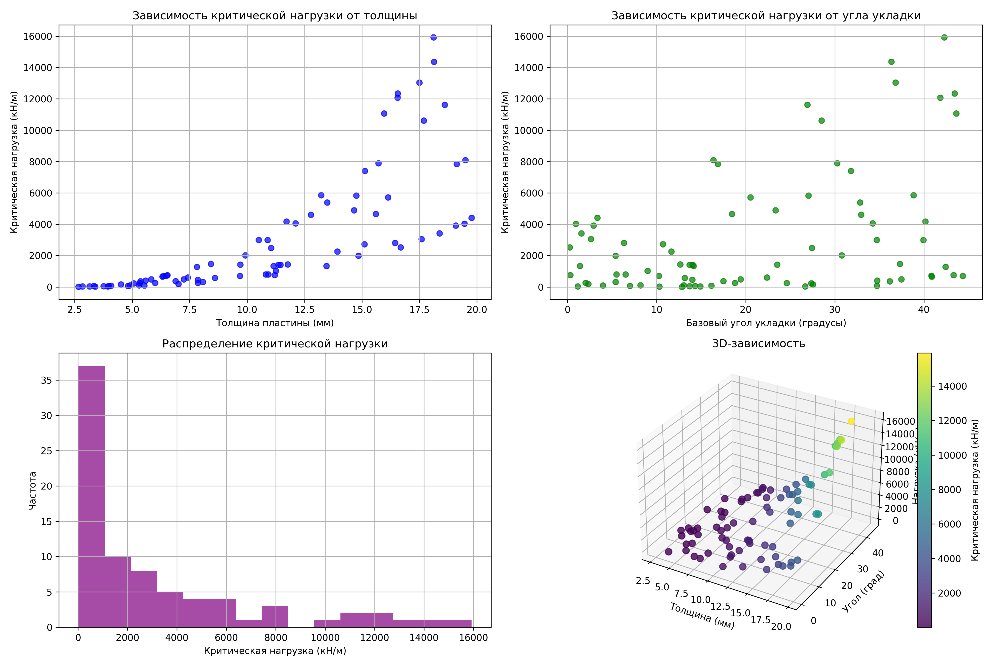

# bachelor_diploma_work

Разработка и сравнение адаптивных суррогатных моделей на основе гауссовских процессов для предсказания критической нагрузки на потерю устойчивости композитной панели. Модели обучаются на синтетических данных, а их адаптивность достигается за счёт активного выбора точек (максимизация априорной дисперсии) с целью минимизировать число итераций при заданной точности.

---

### 🛠 Настройка виртуального окружения Poetry

Проект использует [Poetry](https://python-poetry.org/) — современный инструмент управления зависимостями и виртуальными окружениями в Python. Ниже приведены шаги для быстрого старта.

#### 1. Установка Poetry
Если у вас ещё не установлен Poetry, выполните:

```bash
pipx install poetry
```

> Убедитесь, что Python ≥ 3.8 установлен в системе.  

Проверить установку:
```bash
poetry --version
```

#### 2. Настройка окружения проекта
Перейдите в корневую директорию проекта и установите зависимости:

```bash
poetry install
```

Эта команда:
- Создаст изолированное виртуальное окружение.
- Установит все зависимости из `pyproject.toml` (включая dev-зависимости, такие как `pytest`, `matplotlib` и т.д.).


#### 3. Запуск скриптов
Все команды Python следует запускать через Poetry, чтобы использовать правильное окружение:

```bash
# Пример: запуск генерации данных
poetry run python data/generate_data.py

# Или активировать оболочку и работать напрямую
poetry env activate # это выдаст команду, которая активирует окружение: копировать и запустить команду
python data/generate_data.py
```

#### 4. Добавление новых зависимостей
- Для основных зависимостей:
  ```bash
  poetry add numpy scikit-learn
  ```

Poetry автоматически обновит `pyproject.toml` и `poetry.lock`.

---

### 📊 Data Generation  
Скрипт `generate_data.py` автоматически генерирует **80 точек синтетических данных** для обучения суррогатных моделей. Используется аналитическая модель баклинга композитной панели (на основе теории ламинатов), что позволяет обойтись без FEM-софта.  

#### Как запустить:
```bash
cd data
poetry run python generate_data.py
```

#### Что получается:
- **`composite_plate_bucking_data_*.csv`** — данные для обучения (углы укладки, толщина, критическая нагрузка).  
- **`data_statistics_*.txt`** — статистика по диапазонам параметров.  
- **`buckling_data_analysis_*.png`** — визуализация зависимостей (см. пример ниже).  

#### Особенности:
- Генерация **симметричной укладки** `[θ, -θ, 90, 0]s` (8 слоёв).  
- Автоматическое масштабирование под реальные свойства углепластика (T300/934).  
- Настройка диапазонов: толщина (2–20 мм), углы (0–45°).  
- Все файлы сохраняются в папку `data/`.

> 💡 **Зачем это нужно?**  
> Данные используются для сравнения адаптивных и неадаптивных гауссовых процессов. Нет необходимости в дорогостоящих FEM-расчётах — всё работает на физически обоснованной аналитике.  

---

**Пример визуализации из `buckling_data_analysis_*.png`:**  
  
*Зависимость критической нагрузки от толщины и угла укладки*